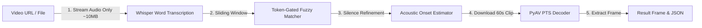

# Dialogue Frame Finder

A speech-first video localization pipeline that finds the exact video frame where a spoken dialogue begins. Powered by Faster-Whisper ASR, fuzzy token-gated matching, acoustic onset refinement, and PyAV Presentation Timestamp (PTS) frame decoding.

---

## Quickstart

### 1. Installation

Ensure you have **Python 3.9+** and **FFmpeg** installed.

```bash
# Clone the repository
git clone https://github.com/kmarif2006/Quest1
cd Quest1

# Create and activate virtual environment
# Windows:
python -m venv venv
.\venv\Scripts\Activate.ps1

# Linux / macOS:
python3 -m venv venv
source venv/bin/activate

# Install dependencies
pip install -r requirements.txt
```

---

### 2. Running the Application

#### Option A: Web Interface (Streamlit)
```bash
streamlit run app.py
```
Open `http://localhost:8501` in your browser. The default benchmark inputs (`https://ok.ru/video/248244667877` and `"My mind rebels at stagnation"`) are pre-filled.

#### Option B: Command Line (CLI)
```bash
python main.py "https://ok.ru/video/248244667877" "My mind rebels at stagnation"
```

#### CLI Options
```text
python main.py <video_url> <target_dialogue> [options]

options:
  --model {tiny,base,small,medium,large-v3}   Whisper model size (default: small)
  --debug                                     Extract +/-1s nearby frames and verbose logs
  --enable-ocr                                Enable subtitle OCR verification
  --force-transcribe                          Bypass transcript cache and re-run ASR
  --force-download                            Bypass video cache and re-download media
```

---

### 3. Run Automated Tests
```bash
pytest tests/ -v
```
Runs the 41-test suite verifying dialogue matching, silence refinement, and frame mapping.

---

## Sample Output

```text
========================================================
  FINAL RESULT
========================================================
Status               : SUCCESS
Target Dialogue      : "My mind rebels at stagnation"
Detected Dialogue    : "My mind rebels at stagnation. Give me problems. Give me work."
Timestamp            : 00:05:21.980
Frame Number         : 7720
Confidence           : 94% (HIGH)
Timing Uncertainty   : +/- 78 ms
Frame Image Saved    : output/result_frame.png
Result JSON Saved    : output/result.json
========================================================
```

Outputs produced:
- `output/result_frame.png`: The exact video frame at dialogue onset.
- `output/result.json`: Structured machine-readable result payload.

---

## 🎬 Working Demo & Proof of Execution

Watch the full end-to-end video pipeline in action (Streamlit UI, fast audio-only streaming, Whisper ASR, phonetic refinement, and exact frame extraction):

[](https://drive.google.com/file/d/1PkaNzGUIzrPb10iPDpJX3YFro9LjIYLo/view?usp=sharing)

> 🔗 **Direct Video Link:** [https://drive.google.com/file/d/1PkaNzGUIzrPb10iPDpJX3YFro9LjIYLo/view?usp=sharing](https://drive.google.com/file/d/1PkaNzGUIzrPb10iPDpJX3YFro9LjIYLo/view?usp=sharing)
> 
> *The demonstration shows running the benchmark input (`https://ok.ru/video/248244667877`, dialogue: `"My mind rebels at stagnation"`), real-time log progression across all 9 pipeline stages, audio streaming optimization, and verified sub-second frame extraction.*

---

## Architecture & Workflow

Rather than decoding and running computer vision on tens of thousands of video frames (O(N) compute), Dialogue Frame Finder uses a **coarse-to-fine speech-first pipeline**:



### Key Engineering Steps

1. **Two-Phase Streaming (Fast-Path):**
   - **Phase 1:** Downloads **only the lightweight audio stream** (~10 MB) as a 16 kHz mono WAV, taking ~5 seconds instead of downloading a 1.6 GB video file.
   - **Phase 2:** Once the dialogue timestamp is identified, fetches **only a 60-second video segment** around that moment for frame extraction.

2. **ASR & Word-Level Timestamps:**
   - Runs `faster-whisper` (INT8 quantized) to obtain word timestamps with schema-backed caching in `output/transcript_<hash>.json`.

3. **Token-Gated Fuzzy Matching:**
   - Evaluates multi-segment sliding windows using composite Levenshtein similarity.
   - Requires >= 60% token coverage to eliminate single-word false positives.

4. **First-Word Silence Refinement:**
   - Detects Whisper boundary artifacts where pre-speech silence is absorbed into the first word token (e.g. word `"My"` reported as 4 seconds long) and recalculates the true acoustic onset.

5. **Hardware Presentation Timestamp (PTS) Frame Mapping:**
   - Uses PyAV to decode packet presentation timestamps, avoiding frame-rate rounding drift (23.976 FPS) and supporting Variable Frame Rate (VFR) containers.

---

## Supported Whisper Models

| Model | Parameters | Speed (CPU) | Accuracy | Best For |
|---|---|---|---|---|
| `tiny` / `tiny.en` | 39 M | ~10x realtime | Good | Rapid testing on low-spec hardware |
| `base` / `base.en` | 74 M | ~7x realtime | Very Good | Balanced default for short clips |
| `small` / `small.en` **(Default)** | 244 M | ~4x realtime | Excellent | High accuracy on diverse accents & background audio |
| `medium` / `medium.en` | 769 M | ~1.5x realtime | State-of-the-Art | Noisy or accented speech |
| `large-v3` | 1550 M | ~0.8x realtime | Maximum | Benchmark-grade transcription |

---

## Repository Structure

```text
├── app.py                     # Streamlit web UI
├── main.py                    # Command-line interface
├── approach.md                # Technical design and architecture deep-dive
├── prompts.txt                # Development notes & prompt history
├── requirements.txt           # Python dependencies
├── src/
│   ├── downloader.py          # Two-phase audio/clip downloader
│   ├── transcriber.py         # Faster-Whisper ASR with word-timestamp caching
│   ├── dialogue_matcher.py    # Fuzzy sliding-window matcher & token filters
│   ├── timestamp_refiner.py   # Silence artifact compensation
│   ├── frame_mapper.py        # PyAV PTS sequential packet decoder
│   ├── frame_extractor.py     # OpenCV single-frame extraction
│   ├── confidence.py          # Confidence & uncertainty calculation
│   └── pipeline.py            # End-to-end 9-stage orchestrator
├── tests/                     # 41 automated pytest unit tests
└── output/                    # Generated result.json and result_frame.png
```

---

## Further Documentation & Media

- **[Working Demo Video Proof (Google Drive)](https://drive.google.com/file/d/1PkaNzGUIzrPb10iPDpJX3YFro9LjIYLo/view?usp=sharing):** Full end-to-end video recording of the working pipeline.
- **[Technical Approach & Architecture](approach.md):** In-depth explanation of the design decisions, latency optimizations, and timing models.
- **[Development Prompts Log](prompts.txt):** Engineering prompts, design questions, and notes used during development.
