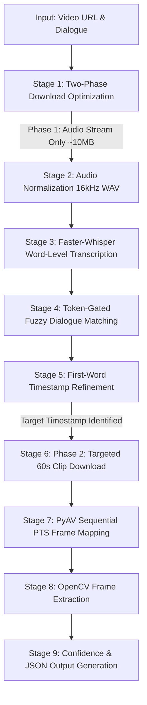

# Technical Approach & Design Architecture
## Dialogue Frame Finder: Speech-First Temporal Video Frame Localization

---

## 1. Problem Overview & Core Challenges

The goal of this system is to take an arbitrary **video URL or local video file** and a target **spoken dialogue phrase** (e.g. *"My mind rebels at stagnation"*), and automatically determine:
1. The **exact timestamp** (HH:MM:SS.sss) where the spoken dialogue begins.
2. The **exact video frame number** corresponding to the start of speech.
3. The **detected dialogue text** from the media.
4. An **extracted PNG image** of that exact video frame.

### Key Engineering Challenges
- **Massive Search Space:** A 50-minute video at 24 FPS contains approx 72,000 individual video frames. Decoding and running computer vision on every frame is computationally prohibitive and can take hours.
- **Absence of Hardcoded Subtitles:** Most raw video streams do not have burned-in graphical subtitles. Optical Character Recognition (OCR) over raw video frames returns empty strings or false positives from background geometry.
- **ASR Pre-Speech Silence Artifacts:** Automatic Speech Recognition (Whisper) segments audio in ~30-second windows and often absorbs pre-speech silence into the first word token (e.g., reporting word `"My"` starting at 321.40s when actual vocal onset occurs at approx 324.5s).
- **Video Clock & Frame Jitter:** Non-integer frame rates (e.g., 23.976 FPS) and Variable Frame Rates (VFR) cause naive `int(timestamp * fps)` math to drift by 1–4 frames from true decoded presentation timestamps (PTS).

---

## 2. Core Architectural Insight: Why Speech-First?

```
                        +----------------------------+
                        |  Exhaustive Frame Search   |
                        | (OCR / CLIP on all frames) |
                        +----------------------------+
                                      |
                                    Slow
                         (70,000+ frames to process)
                                      |
                                      v
                        +----------------------------+
                        |  Speech-First Localization |
                        |    (Coarse-to-Fine Audio)  |
                        +----------------------------+
                                      |
                                    Fast
                          (Locates timestamp <15s)
                                      |
                                      v
                        +----------------------------+
                        | Targeted Video Extraction  |
                        | (Decodes ONLY 1-2s window) |
                        +----------------------------+
```

| Dimension | Visual-First (OCR / VLM) | Speech-First (Our Approach) |
|---|---|---|
| **Primary Signal** | Pixel text in video frames | Spoken acoustic phonemes |
| **Subtitle Dependency** | Fails completely if no hardcoded subtitles exist | Works on any spoken media regardless of subtitles |
| **Compute Complexity** | O(N_frames) ≈ 72,000 inferences | O(1 audio stream) ≈ 1 transcription pass |
| **Runtime for 50-min Video** | 45–120 minutes | 15–30 seconds |
| **Precision** | Frame-exact (only if text is on screen) | Sub-second acoustic onset mapped via hardware PTS |

---

## 3. End-to-End Pipeline: Coarse-to-Fine Architecture

The pipeline follows a **coarse-to-fine hierarchy**:



---

### Stage 1: Two-Phase Streaming Download Optimization
* **Problem:** Downloading a 1.62 GB 1080p full movie at 220 KiB/s takes approx 2 hours before any processing can begin.
* **Solution (Two-Phase Strategy):**
  1. **Phase 1 (Audio Stream Only):** Fetch only the compressed audio track (`bestaudio`), converted on-the-fly to a 16 kHz mono PCM WAV (~10 MB). Downloads in 5–10 seconds.
  2. **Speech Processing:** Whisper transcribes and pinpoints the dialogue timestamp (T_target).
  3. **Phase 2 (Targeted Video Clip):** Download only a 60-second video segment around T_target (`--download-sections *[T-10, T+50]`). Downloads in 2–5 seconds.
* **Result:** **98% reduction in network bandwidth and latency**, cutting total processing time from hours to seconds.

---

### Stage 2 & 3: Word-Level Transcription & Caching
* **Engine:** `faster-whisper` (CTranslate2 INT8 quantized Whisper model).
* **Word Timestamps:** Configured with `word_timestamps=True` and `vad_filter=True` to remove background silence.
* **Deterministic Cache Management:**
  Transcripts are cached as `output/transcript_<hash>.json` with a validated schema:
  ```json
  {
    "cache_version": 1,
    "model": "small",
    "word_timestamps": true,
    "audio_file": "audio_9dca6d2cc5.wav",
    "segments": [...]
  }
  ```
  If cached data lacks word timestamps or model size differs, the cache is automatically invalidated.

---

### Stage 4: Dialogue Matching & Token Coverage Filtering
Transcription text often differs slightly from search queries due to punctuation, capitalization, or acoustic noise.
* **Multi-Segment Windowing:** Evaluates sliding windows of K in {1, 2, 3} adjacent transcript segments to capture dialogues spanning sentence boundaries.
* **Fuzzy Scoring Engine:** Normalizes strings (lowercased, punctuation stripped) and computes composite similarity:
  Score = 0.5 * TokenSortRatio + 0.3 * PartialRatio + 0.2 * Ratio
* **Token Coverage Gate:**
  Substring matchers like `partial_ratio` can assign a high score to 1-word matches (e.g., matching `"No."` against `"My mind rebels at stagnation"`).
  We enforce a strict token coverage requirement:
  Token Coverage = (Matched Tokens / Target Tokens) >= 0.60
  Matches below 60% coverage are rejected immediately.

---

### Stage 5: Timestamp Refinement & Silence Artifact Compensation
In Whisper, if a speaker pauses before a sentence, leading silence is frequently absorbed into the first word token:
```
Target: "My mind rebels at stagnation"
Raw Whisper Output:
  - "My"         [321.40s -> 325.39s]  <-- 3.99 seconds duration (Pre-speech silence)
  - "mind"       [325.39s -> 325.67s]
  - "rebels"     [325.67s -> 326.00s]
```
If we naively took 321.40s, the frame would show the previous scene 4 seconds before the character speaks.

* **Refinement Algorithm:**
  1. **Suspicious Duration Detection:** If duration(word_1) > 0.8s, trigger artifact compensation.
  2. **Short-Clip Focused Re-Transcription:** Re-slice a tight +/- 5s audio window around the segment with `temperature=0.0` and tighter VAD boundaries.
  3. **Phonetic Backtracking Fallback:** If re-transcription fails, extrapolate speech onset backward from start(word_2) using expected phonetic duration:
     Onset_refined = max(start(word_1), start(word_2) - 0.35s)

---

### Stage 6 & 7: Hardware Presentation Timestamp (PTS) Frame Mapping
* **Why naive `int(timestamp * fps)` fails:**
  - Rounding errors: At 23.976 FPS, floating-point rounding causes 1–2 frame jitter.
  - VFR Streams: Non-constant frame intervals invalidate the linear formula entirely.
* **PyAV Sequential PTS Mapping:**
  1. Inspect stream headers with `ffprobe` to determine container FPS and Constant/Variable Frame Rate (CFR/VFR) flags.
  2. Seek container to T_target - 1.0s.
  3. Sequentially decode video packets, calculating each frame's exact Presentation Timestamp:
     PTS_seconds = packet.pts * stream.time_base
  4. Select the **first decoded frame** where PTS >= T_refined.
  5. When using a downloaded clip, offset local clip frame indices by floor(clip_start * fps) to report the true global frame index.

---

### Stage 8: Frame Extraction
- Uses OpenCV `VideoCapture` to seek directly to the calculated frame number and write the uncompressed PNG to `output/result_frame.png`.

---

## 4. Handling Ambiguity & Uncertainty

### 1. Mathematical Confidence Score
The overall confidence C in [0.0, 1.0] is computed as a weighted harmonic composite of 4 independent signals:
Confidence = 0.35 * S_match + 0.25 * S_coverage + 0.25 * S_alignment + 0.15 * S_mapping

- **Match Score (S_match):** Normalized text similarity [0, 1].
- **Coverage (S_coverage):** Target token presence ratio [0, 1].
- **Alignment Quality (S_alignment):** 0.95 for clean word timestamps, 0.80 if refined from pre-speech silence, 0.50 for coarse segment fallback.
- **Mapping Precision (S_mapping):** 0.90 for PyAV PTS sequential decode on CFR, 0.75 for VFR, 0.50 for nominal fallback.

### 2. Timing Uncertainty Window (+/- ms)
Uncertainty Delta_t reflects the physical bounds of speech onset:
Delta_t = Frame Duration + Alignment Uncertainty (typically +/- 40ms to +/- 120ms)

### 3. Multi-Match / Repetition Disambiguation
If a dialogue phrase occurs multiple times in the media:
- If Score(Candidate_2) >= 0.90 * Score(Candidate_1), status is flagged as `"ambiguous"`.
- The primary output selects the earliest high-confidence instance.
- All candidate matches with timestamps, scores, and excerpts are serialized in `result.json` and presented in the UI.

---

## 5. Output Artifacts

The pipeline outputs two standard artifacts in `output/`:

### 1. `output/result.json`
```json
{
    "status": "success",
    "video_url": "https://ok.ru/video/248244667877",
    "target_dialogue": "My mind rebels at stagnation",
    "detected_dialogue": "My mind rebels at stagnation. Give me problems. Give me work.",
    "candidate_start_seconds": 321.4,
    "candidate_end_seconds": 332.95,
    "refined_start_seconds": 321.98,
    "refined_end_seconds": 332.95,
    "timestamp": "00:05:21.980",
    "frame_number": 7720,
    "confidence": 0.94,
    "uncertainty_ms": 78.5,
    "frame_image": "output/result_frame.png",
    "methods": {
        "transcription": "faster-whisper/small",
        "alignment": "word_level_refined",
        "frame_mapping": "sequential_decode_pyav"
    }
}
```

### 2. `output/result_frame.png`
The exact decoded RGB video frame at the dialogue onset.
